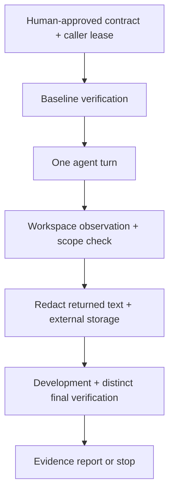
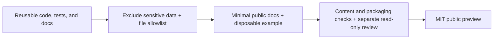

# Mercury

[한국어](README.md) | English

Mercury is a local reliability harness that makes a coding agent's work scope
and completion evidence explicit. It observes repository state before and after
a human-approved task and judges completion from mandatory verification results.
The Python package is `agent-harness`, version `0.1.0`.

| At a glance | Details |
| --- | --- |
| Current scope | A developer preview for integrating the single-agent Python API. macOS is the initial runtime target; POSIX process and locking APIs are required. |
| Runnable example | Change `value.txt` from `before` to `after` in a disposable Git repository and pass the protected `check.py` verification. |
| Future directions | Proposed work includes comparable model/skill evaluations, structured review artifacts, optional review/preview integrations, and clearer usage docs. Implementation and dates are not promised. |

## What works today

| Capability | Current support |
| --- | --- |
| Contracts and admission records | Define a goal, allowed paths, protected paths, and completion criteria; validate that the admission record matches the contract. |
| Single-agent loop | Compose baseline, development, and distinct final verification, scope checks, evidence mappings, and budgeted retries or stops. `CodexCLIAdapter` is the first native adapter. |
| Storage and recovery evidence | Store external state/journal and output redacted by caller policy. Explicit verification continuation is available for supported checkpoints. |
| CLI | Supports `--help`, `--version`, and `profile [path]`. Profiling emits Git filename information as JSON; there is no `run` subcommand. |

## Run the disposable example

Requirements: Python 3.12+, Git, and local macOS. Run from the repository root.

```sh
python3.12 -m venv .venv
.venv/bin/python -m pip install .
.venv/bin/python examples/quickstart.py --approve-demo
```

Read [the example code](examples/quickstart.py) and [quickstart guide](docs/quickstart.md)
first. `--approve-demo` admits only this disposable task: allow `value.txt`, protect
`check.py`, and require the unchanged verification to pass. It grants no authority
over an existing repository.

The example uses a **simulated Codex adapter**, with no native-agent, model, or
network invocation. It creates a temporary Git repository and a temporary state
directory outside it, runs `run_loop` while the caller holds the lock, then deletes
both. Verification fails on the initial value and passes after the edit in the
development and distinct final verification phases.

A successful run prints the result below. One of the four boundaries represents
the simulated agent turn; the other three are real local verification commands.
The example returns nonzero for a different result.

```json
{"command_boundaries": 4, "criteria_passed": true, "mode": "simulated", "reason": "final_verification", "redaction_checked": true, "status": "pass"}
```

The CLI is also available after installation.

```sh
.venv/bin/local-harness --help
.venv/bin/local-harness --version
.venv/bin/local-harness profile .
```

## Start with the Python API

After installation, run this code in Python. It builds a contract and demo
admission record in memory, then validates their match with `admit`. It changes
no files and launches no verification command or agent. `demo-human` is a demo
identifier; this API does not authenticate or obtain a real person's approval.

```python
from datetime import UTC, datetime

from agent_harness.admission import admit, record_admission
from agent_harness.contract import TaskContract

contract = TaskContract(
    goal="Change the disposable fixture value from before to after",
    allowed_paths=("value.txt",),
    protected_paths=("check.py",),
    completion_criteria=("value.txt contains after and check.py remains unchanged",),
)
admission = record_admission(
    contract,
    approver="demo-human",
    approved_at=datetime.now(UTC).isoformat(),
)
admitted = admit(contract, admission)
print(admitted.to_json())
```

See [the runnable simulated example](examples/quickstart.py) for the full `run_loop`
composition. A real-repository integration needs the following caller inputs and
responsibilities.

| Caller responsibility | Required inputs |
| --- | --- |
| Actual human approval and scope | An approved contract, allowed/protected paths, and meaningful completion criteria |
| Context and verification | Explicitly selected context and byte limits, frozen mandatory verification commands, and exact command mappings for every criterion |
| Serialization and state | A lease shared by callers on the same repository, heartbeat as needed, serialized work, and state/journal/output locations outside the target repository |
| Native execution | A trusted Codex CLI executable and environment. The real adapter inherits existing configuration, rules, authentication, and environment. |
| Output and budgets | A redaction policy suited to the caller, input/output sizes, time/retry/command-boundary budgets |

These settings are Python inputs; there is no general configuration-file loader.
Command-boundary budgets do not control individual commands inside a real native
agent.

## Execution flow and boundaries



This diagram summarizes the normal path. Failures, scope violations, or uncertainty
can require an early stop or human judgment; permitted retries also stay within
budget. Process exit or output storage alone does not establish technical PASS.

Observations are point-in-time checks without hostile-process confinement. Ignored
untracked files and Git internals are outside aggregate observations; callers
select protected inputs. The redaction example is not a general secret detector,
and raw text can remain in memory. State storage and journal ordering provide no
fsync/power-loss durability guarantee. Automatic native-session recovery, runtime
multi-agent orchestration, and messenger control are outside this preview.

## Preparing the public preview



This documents how approved reusable assets form a public preview after sensitive
information is excluded. It is not a runtime or automatic publishing feature.
Each step requires its own verification results.

## Future directions

These items are proposals, with no approved development work or release schedule.
Each needs a scoped decision; integrations also need decisions on providers and
execution environments.

| Proposed direction | What to explore |
| --- | --- |
| Small comparable evaluations | Compare models and skills on a few fixed tasks with the same baseline, checks, and budgets; record outcomes and costs, including failures. |
| Structured review artifacts | Make review-candidate and finding artifacts that link evidence and locations for inspection. |
| Optional review/preview integrations | Consider read-only review or preview/runtime verification integrations after their scope is approved. |
| Usage docs and integration examples | Improve guides and examples for connecting the existing API to real projects. This does not indicate an implemented task-run CLI. |

## Contributing and license

See [CONTRIBUTING.md](CONTRIBUTING.md) for development checks and feedback.
Licensed under the [MIT License](LICENSE). Copyright (c) 2026 Mercury (kssk3).
