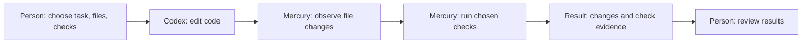

# Mercury

[한국어](README.md) | English

After asking AI to fix code, you still need to check two things: **which files
changed, and whether your chosen checks actually passed**. The AI's statement
that it is done does not answer those questions.

Mercury is a local Python tool that observes code changes and collects check
results for a task, file scope, and commands chosen by a person. It provides
evidence for that person's review. What you can run today is a simulator that
does not call AI. Connecting a real coding agent requires Python integration
by a developer.

## What problem does it help with?

**This is a hypothetical shopping-cart integration story, not a runnable tutorial.**
Imagine a price of 100 with a 10% discount: the result should be 90, but the
current code returns 80.

- A person chooses the task: fix the 10% discount calculation.
- They allow edits to `cart.py` and keep `tests/test_cart.py` unchanged.
- For example, they choose `python -m pytest tests/test_cart.py` as the check.
- Codex edits the code; Mercury observes file changes and runs the chosen check.
- The person reviews the changed files and actual check results before accepting
  the work.

This repository does not provide those cart files or tests. The command above
is not an instruction to run it here. This is the conceptual path after a real
Python integration has been set up.



An AI explanation does not replace actual check results. Observing scope does
not prevent every unwanted edit, and Mercury does not provide a security sandbox.

## Try it today: a simulator with no AI

The provided example uses a small text file instead of a shopping cart. It
changes `value.txt` from `before` to `after` in a temporary Git repository and
checks it with `check.py`, which must stay unchanged. **Python code in a simulated
Codex adapter makes the edit; no native agent, model, or network is invoked.**

You need macOS, Git, and Python 3.12 or newer. The commands below use the
`python3.12` executable. You need no Codex CLI, model account, or API key.
Downloading the repository and installing the package may need internet access;
running the simulator itself is offline.

### 1. Get the preview branch

Run this from an empty working location. It explicitly selects the branch
containing the example.

```sh
git clone --branch main --single-branch https://github.com/kssk3/Mercury.git mercury-demo
cd mercury-demo
```

You will have the docs, package source, and `examples/quickstart.py` in `mercury-demo`.

### 2. Prepare Python and the package

```sh
python3.12 -m venv .venv
.venv/bin/python -m pip install .
```

This creates a separate Python environment in `.venv` and installs this
repository's `agent-harness` package there.

### 3. Run the example and read its result

Read [the example code](examples/quickstart.py), then run it. `--approve-demo`
approves only this temporary file edit and check; it does not approve work on an
existing repository. Omitting the flag exits before creating the temporary repository.

```sh
.venv/bin/python examples/quickstart.py --approve-demo
```

A successful run prints:

```json
{"command_boundaries": 4, "criteria_passed": true, "mode": "simulated", "reason": "final_verification", "redaction_checked": true, "status": "pass"}
```

| Output | Meaning |
| --- | --- |
| `mode: simulated` | Fixed Python simulator code changed the file, with no AI. |
| `status: pass`, `criteria_passed: true` | The chosen completion criterion and final check passed. |
| `reason: final_verification` | A separate check after the edit confirmed the result again. |
| `command_boundaries: 4` | The run crossed four boundaries: check before the edit, simulated edit, check after the edit, and a distinct final check. |
| `redaction_checked: true` | A synthetic example marker was masked before storage. This is not a general secret detector. |

The initial `before` value fails the check; it passes after the simulated edit.
Success returns exit code 0. If the run reports failure or an unconfirmed result,
it prints the status and reason and returns nonzero.

When the example ends, it deletes the temporary Git repository and its temporary
state/output stored outside that repository. Your downloaded `mercury-demo` and
installed `.venv` remain. See [the quickstart guide](docs/quickstart.md) for details.

## Connect a real repository and agent

The current package is `agent-harness` 0.1.0, a single-agent Python API developer
preview. macOS is the initial runtime target; POSIX process and locking APIs are
required. [CodexCLIAdapter](src/agent_harness/adapter.py) and
[run_loop](src/agent_harness/loop.py) exist, but there is no complete beginner
live-task CLI or ready-to-run live integration tutorial. You need to write the
caller integration using [the full simulator composition](examples/quickstart.py).

| What your integration must supply | Responsibility |
| --- | --- |
| Task and actual human approval | Allowed/protected files and meaningful completion criteria. Use the [task contract](src/agent_harness/contract.py) and [admission record](src/agent_harness/admission.py) APIs; an admission record does not obtain or authenticate a person's approval. |
| Checks | Protected checks/configuration, frozen mandatory commands, and exact command mappings for each criterion. Define the [verification policy](src/agent_harness/policy.py). |
| Context and budgets | Selected file context, input/output sizes, time/retry/command-boundary limits |
| Concurrent work and state | A lock lease shared by callers on the same repository, heartbeat as needed, serialized work, and state/journal/output locations outside the target repository |
| Agent and output | A trusted Codex CLI and environment, plus a redaction policy for real output. The adapter inherits existing configuration, rules, authentication, and environment. |

These settings are Python inputs; there is no general configuration-file loader.
Command-boundary budgets do not control individual commands inside the native agent.

The installed CLI offers these information commands. `profile` emits Git filename
information as JSON; there is no task-running `run` subcommand.

```sh
.venv/bin/local-harness --help
.venv/bin/local-harness --version
.venv/bin/local-harness profile .
```

## Limits to understand

Observations are point-in-time checks. Ignored untracked files and Git internals
are outside aggregate observations, and the caller selects protected inputs.
Process exit or output storage alone does not establish technical PASS. Passing
the chosen checks does not prove that all behavior is correct; check selection
and final human review matter.

Raw text can remain in memory before redaction. State storage and journal ordering
provide no fsync/power-loss durability guarantee. Explicit verification continuation
exists for supported checkpoints, but automatic native-session recovery, runtime
multi-agent orchestration, and messenger control are not currently supported.

## Directions to explore

These are proposed directions, with no promise of implementation, approved work,
or release dates. Each needs its own scope; integrations also need decisions on
providers and execution environments.

- Easier first-use entry points and real-repository integration examples
- Model/skill comparisons on fixed tasks with the same baseline, checks, and
  budgets, recording outcomes, failures, and costs
- Structured review-candidate/finding artifacts that link evidence and locations
- Optional read-only review and preview/runtime verification integrations

## Contributing and license

See [CONTRIBUTING.md](CONTRIBUTING.md) for development checks and feedback.
Licensed under the [MIT License](LICENSE). Copyright (c) 2026 Mercury (kssk3).
