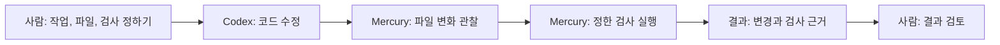

# Mercury

한국어 | [English](README.en.md)

AI에 코드 수정을 맡긴 뒤에는 두 가지를 확인해야 합니다. **어떤 파일이 바뀌었는지,
내가 정한 검사를 실제로 통과했는지**입니다. AI가 “완료했다”고 말하는 것만으로는
이 두 가지를 알 수 없습니다.

Mercury는 사람이 정한 작업과 파일 범위, 검사 명령을 바탕으로 코드 변경을 관찰하고
검사 결과를 모으는 로컬 Python 도구입니다. 사람이 결과를 검토할 때 쓸 근거를
제공합니다. 지금 바로 실행해 볼 수 있는 것은 AI를 부르지 않는 모의 예제입니다.
실제 코딩 에이전트 연결은 개발자를 위한 Python 통합이 필요합니다.

## 어떤 문제에 쓰나요?

**다음은 가상의 장바구니 연동 사례입니다. 실행 가능한 튜토리얼은 아닙니다.**
가격 100에 10% 할인을 적용하면 90이 되어야 하는데, 현재 코드는 80을 반환한다고
가정해 보겠습니다.

- 사람이 “10% 할인 계산을 고쳐 달라”는 작업을 정합니다.
- 수정할 파일은 `cart.py`, 그대로 유지할 검사는 `tests/test_cart.py`로 정합니다.
- 선택한 검사 명령은 예를 들어 `python -m pytest tests/test_cart.py`입니다.
- Codex가 코드를 수정하면 Mercury는 파일 변화를 관찰하고 정한 검사를 실행합니다.
- 사람은 변경된 파일과 실제 검사 결과를 검토해 작업을 받아들일지 판단합니다.

이 저장소에는 위 장바구니 파일이나 테스트가 제공되지 않습니다. 위 명령도 여기서
실행하는 안내가 아닙니다. 실제 Python 연동이 갖춰졌을 때의 개념적 흐름입니다.



AI의 설명은 실제 검사 결과를 대신하지 않습니다. 범위를 관찰한다고 모든 잘못된
수정을 미리 막는 것은 아니며, Mercury가 보안 격리 환경을 제공하는 것도 아닙니다.

## 지금 실행해 보기: AI 없는 모의 예제

실제로 제공되는 예제는 장바구니 대신 작은 텍스트 파일을 사용합니다. 임시 Git
저장소의 `value.txt`를 `before`에서 `after`로 바꾸고, 변경을 허용하지 않은
`check.py`로 결과를 검사합니다. **모의 Codex 어댑터의 Python 코드가 값을 바꾸며,
네이티브 에이전트·모델·네트워크는 호출하지 않습니다.**

준비물은 macOS, Git, Python 3.12 이상입니다. 아래 명령은 `python3.12` 실행 파일을
사용합니다. Codex CLI나 모델 계정, API 키는 필요하지 않습니다. 저장소 다운로드와
패키지 설치에는 인터넷이 필요할 수 있지만, 모의 예제 실행 자체는 오프라인입니다.

### 1. 프리뷰 브랜치 받기

빈 작업 위치에서 아래 명령을 실행합니다. 예제가 포함된 브랜치를 정확히 선택합니다.

```sh
git clone --branch Venus/public-export-20261009 --single-branch https://github.com/kssk3/Mercury.git mercury-demo
cd mercury-demo
```

완료하면 `mercury-demo` 디렉터리에 문서, 패키지 소스, `examples/quickstart.py`가 있습니다.

### 2. Python 환경과 패키지 준비하기

```sh
python3.12 -m venv .venv
.venv/bin/python -m pip install .
```

`.venv`에 별도 Python 환경을 만들고 이 저장소의 `agent-harness` 패키지를 설치합니다.

### 3. 예제 실행과 결과 확인하기

[예제 코드](examples/quickstart.py)를 읽은 뒤 실행합니다.
`--approve-demo`는 이 임시 파일 변경과 검사만 승인합니다. 기존 저장소의 작업을
승인하지 않습니다. 이 옵션을 빼면 임시 저장소를 만들기 전에 종료합니다.

```sh
.venv/bin/python examples/quickstart.py --approve-demo
```

정상 실행 결과는 다음과 같습니다.

```json
{"command_boundaries": 4, "criteria_passed": true, "mode": "simulated", "reason": "final_verification", "redaction_checked": true, "status": "pass"}
```

| 출력 | 뜻 |
| --- | --- |
| `mode: simulated` | AI가 아닌 고정된 Python 모의 코드가 파일을 바꿨습니다. |
| `status: pass`, `criteria_passed: true` | 정한 완료 기준과 최종 검사를 통과했습니다. |
| `reason: final_verification` | 변경 후 검사를 별도로 다시 실행해 확인했습니다. |
| `command_boundaries: 4` | 변경 전 검사, 모의 변경, 변경 후 검사, 별도 최종 검사의 네 경계를 거쳤습니다. |
| `redaction_checked: true` | 예제용 가상 표시 문자열이 저장 전에 가려졌음을 확인했습니다. 일반 비밀정보 탐지 기능을 뜻하지는 않습니다. |

처음에는 값이 `before`여서 검사가 실패하고, 모의 변경 뒤에는 통과합니다. 성공하면
종료 코드는 0입니다. 실행 결과가 실패나 미확인으로 보고되면 상태·이유가 출력되고
0이 아닌 값으로 종료합니다.

예제가 끝나면 임시 Git 저장소와 그 밖에 둔 임시 상태·출력도 삭제됩니다.
다운로드한 `mercury-demo`와 설치한 `.venv`는 남습니다. 더 자세한 설명은
[빠른 시작 안내](docs/quickstart.md)에 있습니다.

## 실제 저장소와 에이전트 연결하기

현재 패키지는 `agent-harness` 0.1.0, 단일 에이전트 Python API 개발자 프리뷰입니다.
초기 런타임 대상은 macOS이며 POSIX 프로세스·잠금 API가 필요합니다.
[CodexCLIAdapter](src/agent_harness/adapter.py)와 [run_loop](src/agent_harness/loop.py)는
있지만, 초보자가 실제 과제를 바로 실행할 완성된 CLI나 실전 연동 튜토리얼은 없습니다.
[모의 예제의 전체 구성](examples/quickstart.py)을 참고해 호출 코드를 작성해야 합니다.

| 통합 코드에서 정할 것 | 필요한 책임 |
| --- | --- |
| 작업과 실제 사람의 승인 | 허용·보호 파일과 의미 있는 완료 기준. [작업 계약](src/agent_harness/contract.py)과 [승인 기록](src/agent_harness/admission.py) API를 사용합니다. 승인 기록 API가 사람의 승인을 대신 받거나 인증하지는 않습니다. |
| 검사 | 보호할 검사·설정, 고정된 필수 명령, 각 완료 기준과 정확한 명령의 연결. [검증 정책](src/agent_harness/policy.py)을 정합니다. |
| 문맥과 예산 | 선택한 파일의 문맥, 입력·출력 크기, 시간·재시도·명령 경계 한도 |
| 동시 작업과 상태 | 같은 저장소에서 공유하는 잠금 lease와 필요한 heartbeat, 작업 직렬화, 대상 저장소 밖의 상태·저널·출력 위치 |
| 에이전트와 출력 | 신뢰하는 Codex CLI와 환경, 실제 출력에 맞는 민감정보 가림 정책. 어댑터는 기존 설정·규칙·인증·환경을 상속합니다. |

이 설정은 Python 입력으로 제공하며 일반 설정 파일 로더는 없습니다. 명령 경계
예산은 네이티브 에이전트 내부의 개별 명령을 통제하지 않습니다.

설치된 CLI는 아래 정보 확인용 명령을 제공합니다. `profile`은 Git 파일명 정보를
JSON으로 출력하며, 작업을 실행하는 `run` 하위 명령은 없습니다.

```sh
.venv/bin/local-harness --help
.venv/bin/local-harness --version
.venv/bin/local-harness profile .
```

## 알아둘 한계

관찰은 특정 시점의 점검입니다. 무시된 미추적 파일과 Git 내부 파일은 집계 관찰
범위 밖이며, 보호 입력은 호출자가 선택합니다. 프로세스 종료나 출력 저장만으로
기술적 PASS가 성립하지 않습니다. 선택한 검사가 통과했다고 모든 동작이 옳다는
뜻도 아니므로, 검사 기준과 최종 검토는 중요합니다.

가림 처리 전 원문이 메모리에 남을 수 있습니다. 상태 저장과 저널 순서는
fsync·전원 손실 내구성을 보장하지 않습니다. 지원되는 체크포인트의 명시적 검증
이어가기는 있지만, 자동 네이티브 세션 복구·런타임 다중 에이전트 오케스트레이션·
메신저 제어는 현재 지원하지 않습니다.

## 앞으로 살펴볼 방향

아래는 제안된 방향이며 구현이나 승인된 개발 일정·출시 날짜를 약속하지 않습니다.
각 작업의 범위를 별도로 정하고, 연동에는 제공자와 실행 환경 결정도 필요합니다.

- 처음 사용하기 쉬운 진입점과 실제 저장소 통합 예제 개선
- 같은 기준선·검사·예산의 고정 과제로 모델과 스킬을 비교하고 결과·실패·비용 기록
- 근거와 위치를 연결하는 구조화된 리뷰 후보·발견 사항 자료
- 선택적 읽기 전용 리뷰와 프리뷰·런타임 검증 연동 검토

## 기여와 라이선스

개발 점검과 피드백 안내는 [CONTRIBUTING.md](CONTRIBUTING.md)에 있습니다.
[MIT 라이선스](LICENSE)를 적용합니다. Copyright (c) 2026 Mercury (kssk3).
