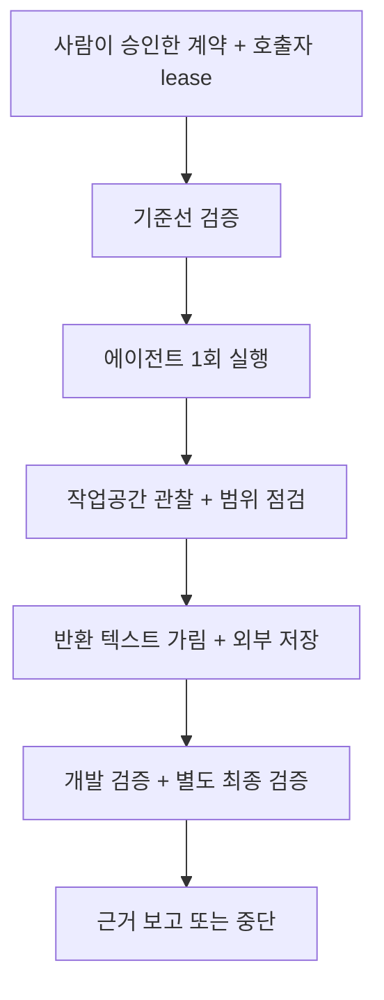
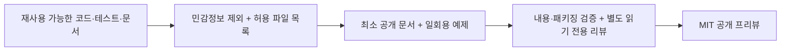

# Mercury

한국어 | [English](README.en.md)

Mercury는 코딩 에이전트의 작업 범위와 완료 근거를 명시하는 로컬 신뢰성
하네스입니다. 사람이 승인한 계약을 바탕으로 작업 전후의 저장소 상태를
관찰하고, 필수 검증 결과로 완료를 판단합니다. Python 패키지 이름은
`agent-harness`, 버전은 `0.1.0`입니다.

| 한눈에 보기 | 내용 |
| --- | --- |
| 현재 범위 | 단일 에이전트 Python API를 통합하는 개발자를 위한 프리뷰. 초기 런타임 대상은 macOS이며 POSIX 프로세스·잠금 API가 필요합니다. |
| 실행 예시 | 일회용 Git 저장소의 `value.txt`를 `before`에서 `after`로 바꾸고, 보호된 `check.py`의 검증을 통과합니다. |
| 향후 방향 | 같은 조건의 모델·스킬 평가, 구조화된 리뷰 자료, 선택적 리뷰·프리뷰 연동, 사용 문서 개선을 제안합니다. 구현·일정 약속은 아닙니다. |

## 현재 사용할 수 있는 기능

| 기능 | 현재 지원 |
| --- | --- |
| 계약과 승인 기록 | 목표, 허용 경로, 보호 경로, 완료 기준을 정의하고 승인 기록과 계약의 일치를 검증합니다. |
| 단일 에이전트 루프 | 기준선·개발·별도 최종 검증, 범위 점검, 근거 연결, 예산 내 재시도 또는 중단을 구성합니다. 첫 네이티브 어댑터는 `CodexCLIAdapter`입니다. |
| 저장과 복구 근거 | 외부 상태·저널과 호출자 정책으로 가린 출력을 저장합니다. 지원되는 체크포인트의 명시적 검증 이어가기가 있습니다. |
| CLI | `--help`, `--version`, `profile [path]`를 지원합니다. 프로파일은 Git 파일명 정보를 JSON으로 출력하며 `run` 하위 명령은 없습니다. |

## 일회용 예제 실행하기

필요한 환경은 Python 3.12+, Git, 로컬 macOS입니다. 저장소 루트에서 실행합니다.

```sh
python3.12 -m venv .venv
.venv/bin/python -m pip install .
.venv/bin/python examples/quickstart.py --approve-demo
```

[예제 코드](examples/quickstart.py)와 [빠른 시작 안내](docs/quickstart.md)를 먼저
읽어 보세요. `--approve-demo`는 이 일회용 과제만 승인합니다. 허용 경로는
`value.txt`, 보호 경로는 `check.py`이며, 변경하지 않은 검증을 통과해야 합니다.
기존 저장소에 대한 작업 권한을 부여하지 않습니다.

예제는 **모의 Codex 어댑터**를 사용하며 네이티브 에이전트·모델·네트워크를
호출하지 않습니다. 임시 Git 저장소와 그 밖의 임시 상태 디렉터리를 만들고,
호출자가 잠금을 유지한 채 `run_loop`를 실행한 뒤 모두 삭제합니다. 초기 값에서
실패한 검증은 변경 후 개발 검증과 별도 최종 검증에서 통과합니다.

성공하면 다음 결과를 출력합니다. 네 경계 중 하나는 모의 에이전트 실행이고,
나머지 셋은 실제 로컬 검증 명령입니다. 결과가 다르면 예제는 0이 아닌 값으로 종료합니다.

```json
{"command_boundaries": 4, "criteria_passed": true, "mode": "simulated", "reason": "final_verification", "redaction_checked": true, "status": "pass"}
```

CLI도 설치 후 사용할 수 있습니다.

```sh
.venv/bin/local-harness --help
.venv/bin/local-harness --version
.venv/bin/local-harness profile .
```

## Python API 시작하기

설치 후 다음 코드를 Python에서 실행할 수 있습니다. 계약과 데모 승인 기록을
메모리에 만들고 `admit`으로 일치를 검증합니다. 파일을 바꾸거나 검증 명령·에이전트를
실행하지 않습니다. `demo-human`은 데모 식별자이며, 이 API가 실제 사람의 승인을
인증하거나 대신 받지는 않습니다.

```python
from datetime import UTC, datetime

from agent_harness.admission import admit, record_admission
from agent_harness.contract import TaskContract

contract = TaskContract(
    goal="Change the disposable fixture value from before to after",
    allowed_paths=("value.txt",),
    protected_paths=("check.py",),
    completion_criteria=("value.txt contains after and check.py remains unchanged",),
)
admission = record_admission(
    contract,
    approver="demo-human",
    approved_at=datetime.now(UTC).isoformat(),
)
admitted = admit(contract, admission)
print(admitted.to_json())
```

전체 `run_loop` 구성은 [실행 가능한 모의 예제](examples/quickstart.py)에 있습니다.
실제 저장소에 연결할 때는 호출자가 다음 입력과 책임을 정해야 합니다.

| 호출자 책임 | 필요한 설정 |
| --- | --- |
| 실제 사람의 승인과 범위 | 승인받은 계약, 허용·보호 경로, 의미 있는 완료 기준 |
| 문맥과 검증 | 명시적으로 선택한 문맥과 바이트 한도, 고정된 필수 검증 명령, 각 완료 기준과 정확한 명령의 연결 |
| 직렬화와 상태 | 같은 저장소에서 공유하는 lease와 필요한 heartbeat, 작업 직렬화, 대상 저장소 밖의 상태·저널·출력 위치 |
| 네이티브 실행 | 신뢰할 수 있는 Codex CLI 실행 파일과 환경. 실제 어댑터는 기존 설정·규칙·인증·환경을 상속합니다. |
| 출력과 예산 | 호출자에 맞는 민감정보 가림 정책, 입력·출력 크기, 시간·재시도·명령 경계 예산 |

이 설정은 Python 입력으로 제공하며 일반 설정 파일 로더는 없습니다.
명령 경계 예산은 실제 네이티브 에이전트 내부의 개별 명령을 통제하지 않습니다.

## 실행 흐름과 경계



이 그림은 정상 경로의 개략도입니다. 실패·범위 위반·불확실성은 조기 중단이나
사람의 판단을 요구할 수 있으며, 허용된 재시도도 예산 안에서만 진행합니다.
프로세스 종료나 출력 저장만으로 기술적 PASS가 성립하지 않습니다.

관찰은 특정 시점의 점검이며 적대적 프로세스를 격리하지 않습니다. 무시된 미추적
파일과 Git 내부 파일은 집계 관찰 범위 밖이고, 보호 입력은 호출자가 선택합니다.
출력 가림 예제는 일반 비밀정보 탐지기가 아니며 원문이 메모리에 남을 수 있습니다.
상태 저장과 저널 순서는 fsync·전원 손실 내구성을 보장하지 않습니다.
자동 네이티브 세션 복구, 런타임 다중 에이전트 오케스트레이션, 메신저 제어는
현재 프리뷰 범위에 포함되지 않습니다.

## 공개 프리뷰 구성 흐름



민감정보를 제외하고 허용한 자산으로 공개 프리뷰를 구성하는 문서화된 흐름입니다.
런타임 기능이나 자동 게시 기능을 뜻하지 않습니다. 각 단계의 확인 결과가 필요합니다.

## 향후 방향

아래 항목은 제안 단계입니다. 승인된 개발 작업이나 출시 일정이 아니며, 각 작업은
범위를 별도로 정해야 합니다. 연동에는 제공자와 실행 환경에 대한 결정도 필요합니다.

| 제안 방향 | 살펴볼 내용 |
| --- | --- |
| 같은 조건의 소규모 평가 | 몇 개의 고정 과제에서 같은 기준선·검증·예산으로 모델과 스킬을 비교하고, 실패를 포함한 결과와 비용을 기록합니다. |
| 구조화된 리뷰 자료 | 리뷰 후보와 발견 사항을 근거·위치와 연결해 검토할 수 있는 자료를 만듭니다. |
| 선택적 리뷰·프리뷰 연동 | 범위를 승인한 뒤 읽기 전용 리뷰 또는 프리뷰·런타임 검증 연동을 검토합니다. |
| 사용 문서와 통합 예제 | 현재 API를 실제 프로젝트에 연결하기 쉬운 안내와 예제를 개선합니다. 새로운 실행 CLI가 구현됐다는 뜻은 아닙니다. |

## 기여와 라이선스

개발 점검과 피드백 안내는 [CONTRIBUTING.md](CONTRIBUTING.md)에 있습니다.
[MIT 라이선스](LICENSE)를 적용합니다. Copyright (c) 2026 Mercury (kssk3).
